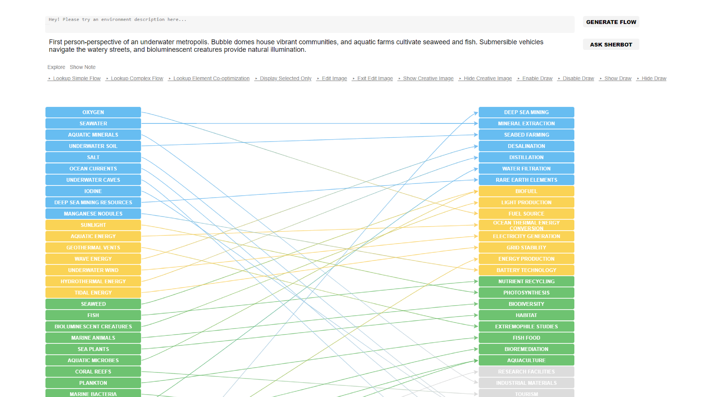
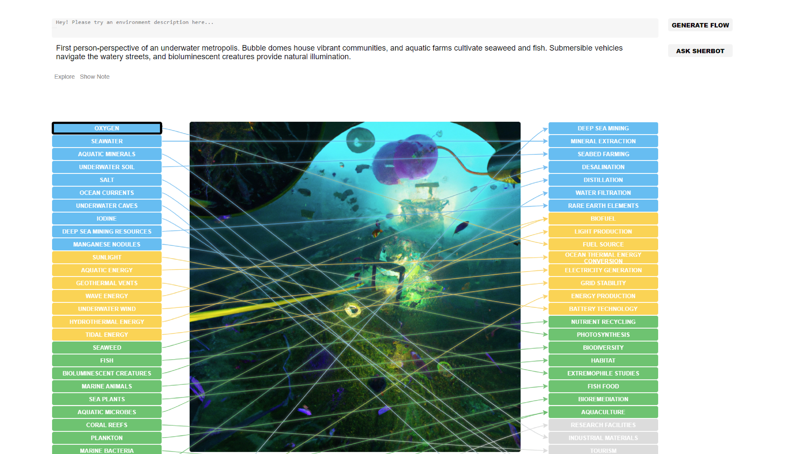
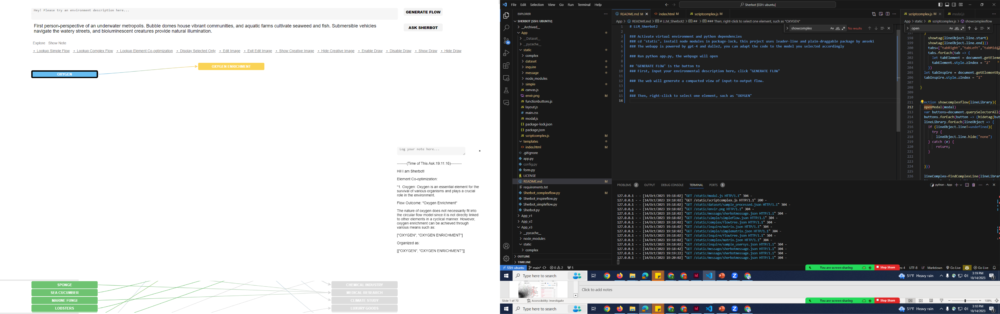
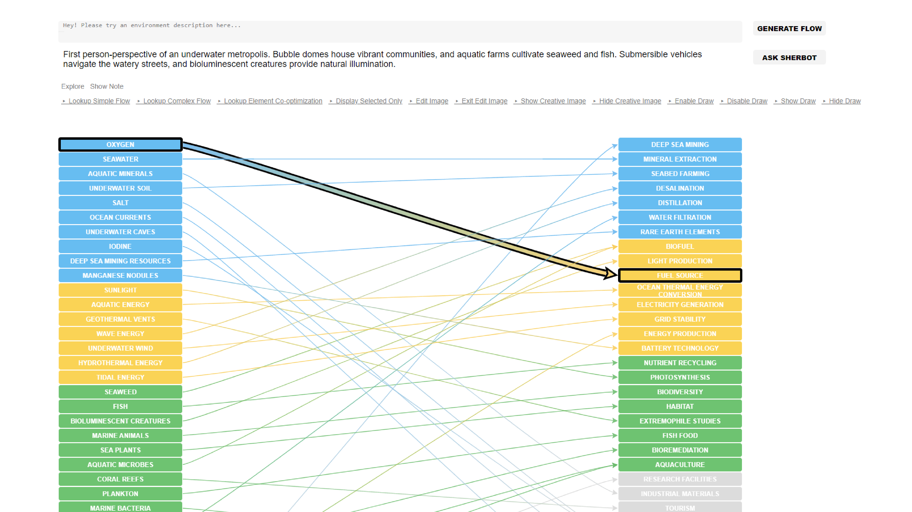
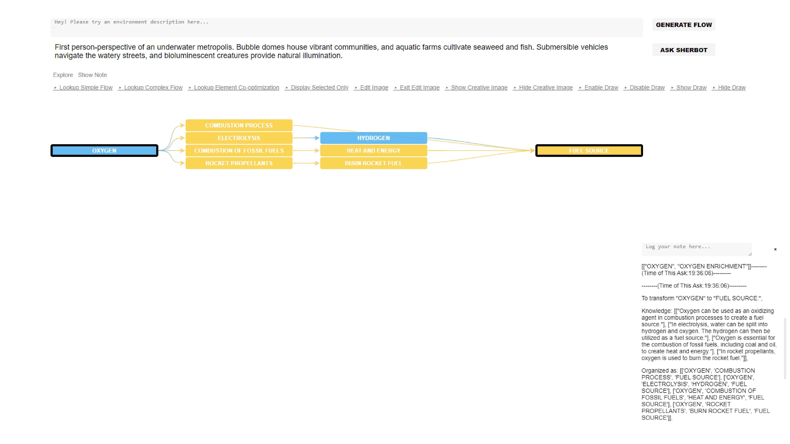

# LLM_Sherbot

Sherbot is an LLM-based web application for generative flow diagrams. As an educative tool for environmental engineering, it generates flow / circular economy diagram and allows freedom for users to doodle and modify.

### Init
1. Activate virtual environment and python dependencies
2. cd "static", install node modules in package-lock, this project uses leader-line and plain-draggable package by anseki
3. The webapp is powered by gpt-4 and dalle2, you can adapt the code to the model you selected accordingly
4. The interactivity of the web will be improved in the next release
5. Run python app.py, the webpage will open

### GENERATE FLOW
1. "GENERATE FLOW" is the button to send new TEXT-TO-FLOW DIAGRAM request.
2. First, Input your environmental description here, click "GENERATE FLOW"

3. The web will generate a compacted view of input-to-output flow. 

<iframe width="960" height="540" src="__Pic__/SimpleFlow_reduced.mp4" frameborder="0" allowfullscreen></iframe>

4. You can toggle image on and off by "Explore > Show Creative Image" and "Explore > Hide Creative Image" 

<!--  -->

### ASK SHERBOT
1. "ASK SHERBOT" is the button to send new request based on the element selections.

##### Trial 1
1. Try, right-click to select one element, such as "OXYGEN"

2. Then, click "ASK SHERBOT" 

3. Now, go back to by clicking "Explore > Lookup Simple Flow"

##### Trial 2
1. Try, right-click to select one flow, such as  right-click "OXYGEN" --> select "Select Output Flow"--> "FUEL SOURCE"

2. Then, click "ASK SHERBOT"
3. The tool will expand on the internal process for generating flow

4. Now, go back to by clicking "Explore > Lookup Simple Flow"

##### Trial 3
### Try, right-click on multiple element and multiple flow, like below
### Then, click "ASK SHERBOT"
### It will generate a complex flow view, delinating multiple processes for going from input to output

### Navigate to "Explore > Lookup Element Co-optimization"
### It will generate a networked flow view, delinating how all the elements can be connected

### Now, go back to by clicking "Explore > Lookup Simple Flow"
### Select all element and flow
### Then, click "ASK SHERBOT"

## This tool contains many editing features under "Explore"
### Here are some examples